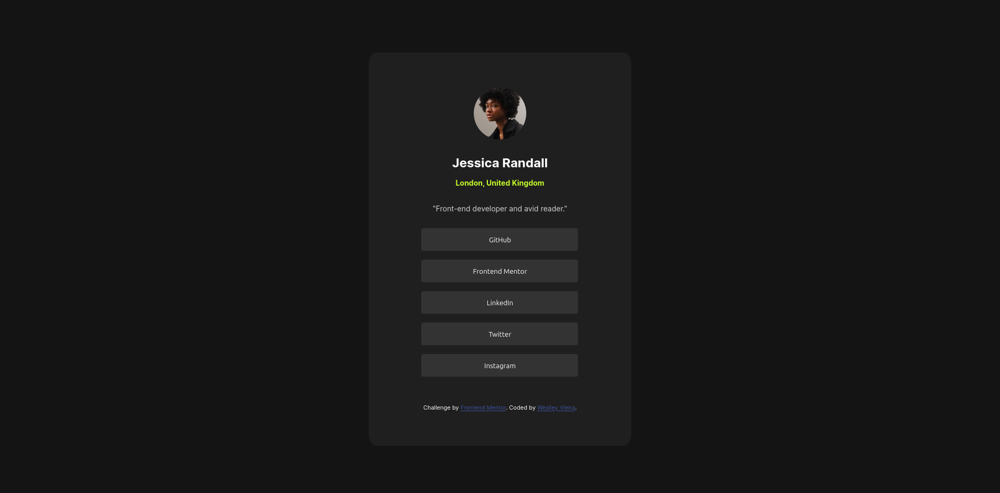

# Frontend Mentor - Social links profile solution

This is a solution to the [Social links profile challenge on Frontend Mentor](https://www.frontendmentor.io/challenges/social-links-profile-UG32l9m6dQ). 

## Overview

### The challenge

Users should be able to:

- See hover and focus states for all interactive elements on the page

### Screenshot

### Links

- Solution URL: [Solução](./index.html)
- Live Site URL: [Vercel](https://social-links-profile-git-main-weslleyvieira-projects.vercel.app/)

### Built with

- HTML5
- CSS

## Author

- CodeCademy - [@weslleyvieira-dev](https://www.codecademy.com/profiles/weslleyvieira-dev)
- Frontend Mentor - [@weslleyvieira-dev](https://www.frontendmentor.io/profile/weslleyvieira-dev)
- Linkedin - [@weslleyvieira-dev](https://www.linkedin.com/in/weslleyvieira-dev/)
- Vercel - [@weslleyvieira-dev](https://vercel.com/weslleyvieira-projects)